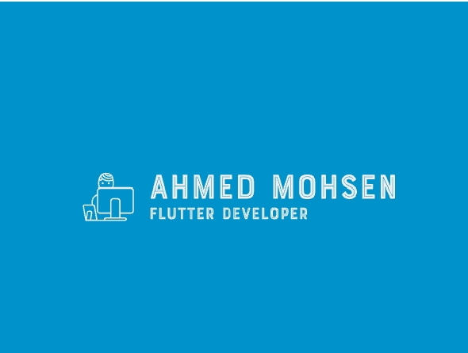

<!--
**AhmedmohseHussein/AhmedmohseHussein** is a ✨ _special_ ✨ repository because its `README.md` (this file) appears on your GitHub profile.

Here are some ideas to get you started:

- 🔭 I’m currently working on ...
- 🌱 I’m currently learning ...
- 👯 I’m looking to collaborate on ...
- 🤔 I’m looking for help with ...
- 💬 Ask me about ...
- 📫 How to reach me: ...
- 😄 Pronouns: ...
- ⚡ Fun fact: ...
-->

# Hi there, I'm Ahmed Mohsen! 👋

## 🚀 About Me
I'm a **Flutter Developer** with a passion for building high-performance, cross-platform mobile applications that provide seamless user experiences. I specialize in crafting modern UI/UX designs and have a strong background in both front-end and back-end integration.

## 🛠️ Skills
- **Programming Languages**: Dart, Kotlin, Java, HTML, CSS, python
- **Frameworks & Libraries**: Flutter, firebase_core, firebase_auth, Firebase_Storage, Cloud_Firestore, Firebase_Database, HTTP, Dio, image_picker, google_fonts, uuid,
- **Tools & Platforms**: Git, GitHub, Firebase, RESTful APIs, Postman
- **Other Skills**: UI/UX design, Responsive Design, State Management (Riverpod, Bloc)

## 🌱 Currently Learning
I'm continuously exploring new tools and technologies in the Flutter ecosystem to stay updated with industry trends.

## 📫 How to Reach Me
- **LinkedIn**: [Ahmed Mohsen](linkedin.com/in/ahmed-mohsen-h#)
- **GitHub**: [Ahmed Mohsen](https://github.com/AhmedmohseHussein#)
- **Email**: [e-mail](am3463485@gmail.com#)

## 💼 Portfolio
Check out my portfolio [here](#).

---

✨ _"Code is like humor. When you have to explain it, it’s bad."_ ✨
